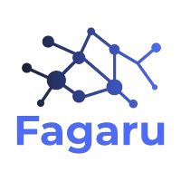
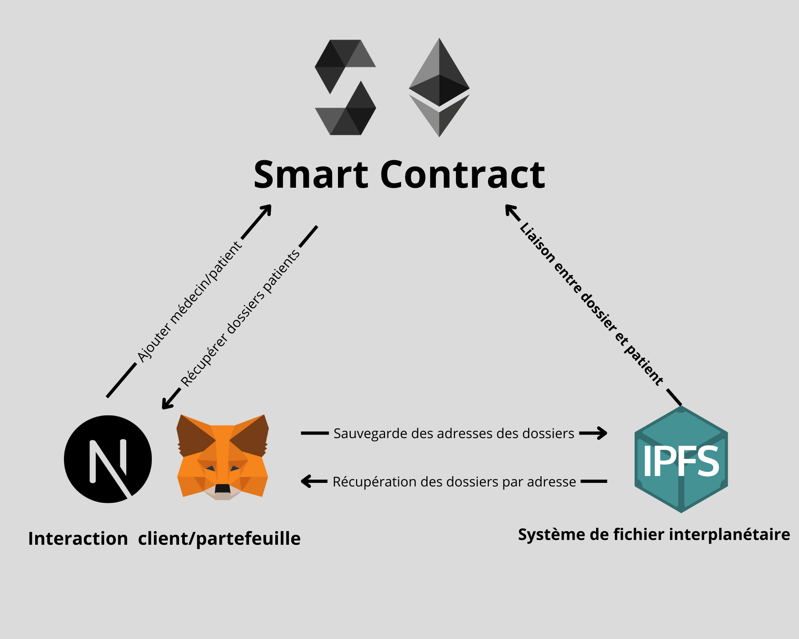

# Fagaru

<p align="center">
  <a href="#"></a>
</p>

<h2 align="center">
  Un système de gestion de dossiers médicaux basé sur la blockchain et IPFS.
</h2>

## Table des matières

- [Caractéristiques clés](#caractéristiques-clés)
- [Comment ça marche](#comment-ça-marche)
- [Comment utiliser](#comment-utiliser)
- [Support](#support)

## Caractéristiques clés

Fagaru utilise [IPFS](https://ipfs.tech/) pour stocker chaque dossier médical de manière distribuée, garantissant une gestion des données décentralisée. Chaque patient possède une identité numérique sur la blockchain Ethereum, permettant un accès sécurisé à ses dossiers par son médecin via des contrats intelligents.

Avec Fagaru, vous pouvez :

- Un professionnel de santé peut s'inscrire en utilisant un portefeuille crypto comme MetaMask.
- Le professionnel de santé peut enregistrer un patient via l'adresse publique du portefeuille de ce dernier.
- Le professionnel peut rechercher les dossiers d'un patient et ajouter de nouveaux dossiers.
- Le patient peut également visualiser ses dossiers après s'être connecté avec un portefeuille dont l'adresse est enregistrée.

## Comment ça marche

Fagaru est composé de trois composants principaux :

1. **Client Next.js** connecté avec MetaMask
2. **Contrat intelligent Solidity** sur la blockchain Ethereum
3. **IPFS** pour le stockage distribué des fichiers

<p align="center">

</p>

Le client se connecte au portefeuille crypto et utilise un contrat intelligent pour enregistrer un utilisateur en tant que patient ou médecin, si son adresse publique n'est pas déjà enregistrée.

L’utilisateur peut télécharger un fichier sur IPFS, dont l'adresse est liée à un bloc de patient sur la blockchain Ethereum. Le client peut obtenir toutes les adresses des dossiers stockées dans le bloc d'un patient depuis le contrat intelligent et récupérer un fichier depuis IPFS.

## Comment utiliser

1. **Installer Truffle** globalement si ce n'est pas encore fait.

   ```sh
   npm install -g truffle
2. **Configurer et déployer** le contrat intelligent sur un réseau local Ethereum, tel que [Ganache](https://archive.trufflesuite.com/ganache/).
    
    ```sh
    cd backend
    npm install
    truffle compile
    truffle migrate --network development
3. Configurer l'adresse du contrat et les clés API Pinata dans un fichier .env.local. Vous pouvez utiliser [Pinata](https://pinata.cloud/).

    ```makefile
      NEXT_PUBLIC_PINATA_API_KEY={VOTRE_CLE_PINATA}
      NEXT_PUBLIC_PINATA_SECRET_KEY={VOTRE_CLE_SECRETE_PINATA}
      NEXT_PUBLIC_CONTRACT_ADRESS={ADRESSE DU CONTRAT}
4. Configurer et lancer le client **Next.js**.

    ```sh
    cd frontend
    npm install
    npm run dev

**Le projet devrait maintenant être accessible à l'adresse http://localhost:3000.**

## Support
**Si ce projet vous a plu, n'hésitez pas à laisser une étoile ⭐️, cela aide d'autres personnes à découvrir Fagaru !**